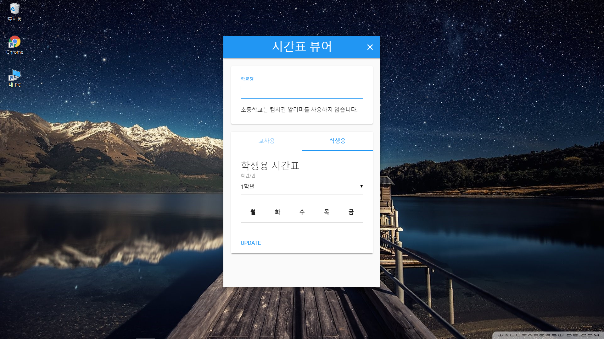
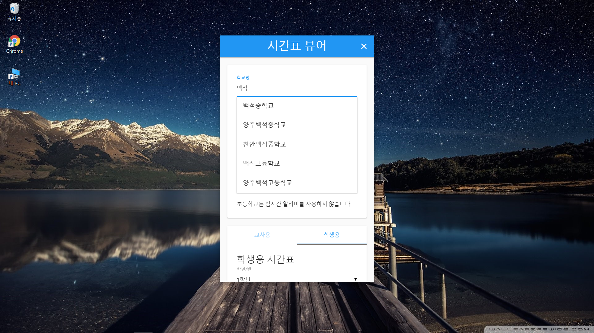
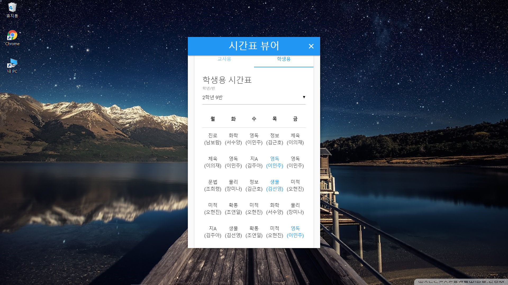
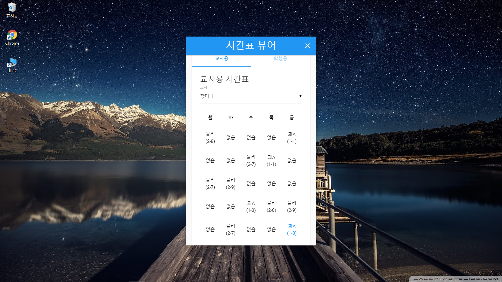

# KoreanSchool ScheduleViewer

<p align="center">
  
</p>

> Korean School Schedule Viewer Application

컴시간 알리미를 이용한 시간표 뷰어 프로그램

## Screenshot

| Main | Search |
|:-:|:-:|
|  |  |

| Student Schedule | Teacher Schedule |
|:-:|:-:|
|  |  |

## License

```text
KoreanSchool ScheduleViewer
Copyright (C) 2017  Astro

This program is free software: you can redistribute it and/or modify
it under the terms of the GNU General Public License as published by
the Free Software Foundation, either version 3 of the License, or
(at your option) any later version.

This program is distributed in the hope that it will be useful,
but WITHOUT ANY WARRANTY; without even the implied warranty of
MERCHANTABILITY or FITNESS FOR A PARTICULAR PURPOSE.  See the
GNU General Public License for more details.

You should have received a copy of the GNU General Public License
along with this program.  If not, see <http://www.gnu.org/licenses/>.
```

KoreanSchool ScheduleViewer is licensed under the [GPL 3.0](./LICENSE).
